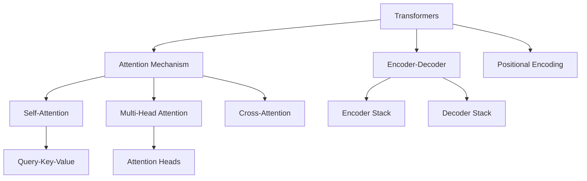

# Mermaid Diagram Format Reference

Diagrams generated from wiki linking and content structure using [Mermaid](https://mermaid.js.org/).

## Diagram Types and When to Use

| Type | Syntax | Best For |
|------|--------|----------|
| `flowchart` | `flowchart TD` / `flowchart LR` | Processes, workflows, decision trees |
| `graph` | `graph TD` | Concept maps, entity relationships |
| `sequenceDiagram` | `sequenceDiagram` | Step-by-step interactions |
| `classDiagram` | `classDiagram` | Type hierarchies, data models |

## Output Format

Diagrams can be:
1. **Inline** in any wiki page using ` ```mermaid ` code blocks
2. **Standalone** in `wiki/presentations/<slug>-diagram.md`
3. **Embedded** in a Marp presentation slide

## Generation Strategies

### Concept Maps (from cross-links)

For a given concept page, generate a `graph TD` showing its relationship to other concepts:

```
graph TD
    A[Target Concept] --> B[Related Concept 1]
    A --> C[Related Concept 2]
    B --> D[Sub-concept]
    C --> D
```

Build from the `## Related Concepts` and `## Sources` sections of wiki pages.

### Flowcharts (from processes)

For "How It Works" sections with numbered steps:

```
flowchart TD
    Step1[Step 1: Description] --> Step2[Step 2: Description]
    Step2 --> Decision{Decision point?}
    Decision -->|Yes| Step3a[Path A]
    Decision -->|No| Step3b[Path B]
```

### Sequence Diagrams (from interactions)

For processes involving multiple actors or components:

```
sequenceDiagram
    participant A as Component A
    participant B as Component B
    A->>B: Action description
    B-->>A: Response description
```

## Naming Rules

Mermaid nodes should use short IDs with descriptive labels:
```
A[Full Description Here]  ✅
fulldescription[Full Description]  ❌ (IDs should be short)
```

## Example: Concept Map

Generated from a wiki page on transformer architectures:

